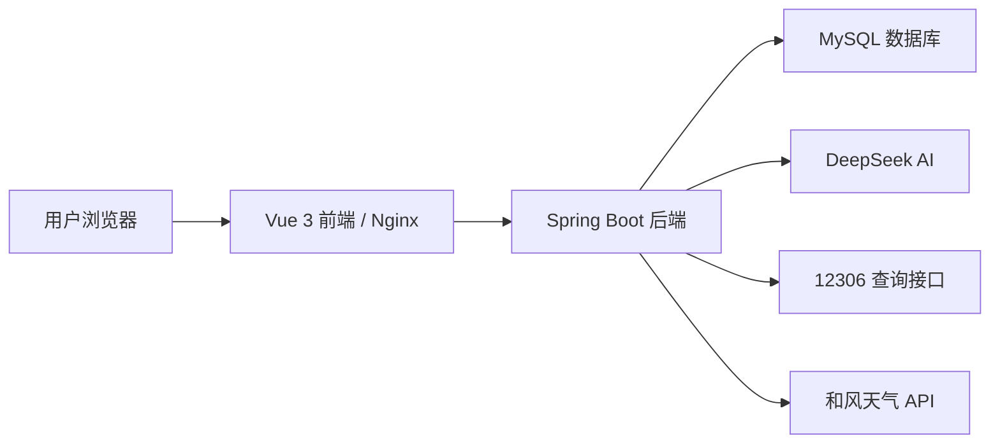

# 智能铁路票务助手答辩说明

## 1. 项目概述

本项目是一个前后端分离的智能铁路票务服务系统，面向用户提供登录注册、车票查询、AI 辅助购票、订单管理、退票确认、天气查询、目的地推荐、个人中心和管理员后台等功能。

系统整体目标不是做一个静态演示页面，而是尽量按照真实软件的方式设计：用户数据、订单数据、会话数据、常用乘车人信息都存入 MySQL；前端通过真实接口访问后端；后端接入 DeepSeek AI、12306 车次查询和和风天气接口；部署环境通过 Docker 统一管理。

## 2. 总体架构

项目采用前后端分离架构：



核心调用流程：

1. 用户在 Vue 前端进行登录、聊天、购票、查询订单等操作。
2. 前端通过 REST API 调用 Spring Boot 后端。
3. 后端完成 JWT 鉴权、参数校验、业务处理和数据库读写。
4. 涉及智能问答时，后端调用 DeepSeek，对用户自然语言进行理解和整理。
5. 涉及车次查询时，后端调用 12306 真实车次接口，并做城市/站点模糊匹配。
6. 涉及天气时，后端调用和风天气 API 返回出发地和目的地天气。
7. 所有业务结果最终回写 MySQL，保证数据可追踪、可复现。

## 3. 前端技术栈

| 技术 | 作用 |
| --- | --- |
| Vue 3 | 构建前端单页应用，负责页面组件化、响应式状态更新和用户交互。 |
| TypeScript | 为前端代码提供类型检查，降低接口字段、组件状态、订单对象使用错误。 |
| Vite | 前端构建工具，提供快速开发服务器和生产环境打包。 |
| Vue Router | 管理首页、登录页、注册页、工作台、个人中心等页面路由。 |
| Pinia | 管理全局状态，例如当前用户、JWT、会话列表、订单列表、待确认订单。 |
| lucide-vue-next | 提供统一风格的图标组件，例如语音输入、订单选择等按钮图标。 |
| Nginx | Docker 环境中托管前端静态文件，并反向代理后端接口。 |

前端设计风格采用新粗野主义风格：粗黑边框、高对比色块、白色主内容区、黄色强调色和青色操作按钮。这样可以让页面具有辨识度，也便于在答辩展示中突出视觉创新。

## 4. 后端技术栈

| 技术 | 作用 |
| --- | --- |
| Java 17 | 后端主要开发语言，提供稳定的企业级开发能力。 |
| Spring Boot 3.4.0 | 后端主框架，负责 REST 接口、依赖注入、配置管理和应用启动。 |
| Spring Web | 提供 Controller、REST API、请求响应处理能力。 |
| Spring Validation | 对登录、注册、购票、订单等请求参数进行校验，减少非法输入。 |
| MyBatis-Plus | 数据访问层框架，简化 CRUD 操作，同时保留灵活 SQL 能力。 |
| MySQL Connector/J | 后端连接 MySQL 数据库的 JDBC 驱动。 |
| JJWT | 生成和校验 JWT Token，实现登录态和接口鉴权。 |
| LangChain4j 依赖预留 | 为 AI 能力扩展提供基础依赖，当前项目同时接入 DeepSeek 客户端。 |

后端按 Controller、Service、Mapper、Entity、DTO 分层：

- Controller：接收前端请求，返回统一 API 响应。
- Service：处理核心业务逻辑，例如订单生成、退票、会话管理。
- Mapper：通过 MyBatis-Plus 操作数据库。
- Entity：对应数据库表结构。
- DTO/VO：用于前后端数据传输，避免直接暴露数据库实体。

## 5. 数据库设计

数据库使用 MySQL，所有账号和业务数据都通过数据库持久化，不使用 H2 或前端假数据。

主要数据表包括：

| 表 | 作用 |
| --- | --- |
| app_user | 存储用户和管理员账号、密码哈希、角色信息。 |
| chat_session | 存储用户会话，实现不同出行咨询之间的隔离。 |
| chat_message | 存储聊天消息，实现历史记录持久化。 |
| ticket_order | 存储已确认订单。 |
| pending_ticket_order | 存储待用户确认的订单，防止 AI 直接出票。 |
| passenger_profile | 存储常用乘车人信息，身份证号进行加密/脱敏处理。 |
| audit_log | 存储关键操作审计日志。 |
| destination_recommendation | 存储目的地推荐数据。 |

设计重点：

- 用户账号和管理员账号通过角色区分，不能互相混用。
- AI 只能帮助整理和生成待确认订单，最终确认必须由用户完成。
- 常用乘车人信息走数据库，用户可选择、保存和复用。
- 订单、退票、会话、聊天记录都可追踪。

## 6. AI 能力设计

项目接入 DeepSeek AI，用于提升自然语言交互能力。AI 的定位不是直接替用户完成危险操作，而是辅助理解、整理和建议。

AI 主要参与以下流程：

1. 意图识别  
   判断用户是在查票、购票、退票、查天气，还是仅仅咨询“周末去哪比较好”。

2. 购票信息整理  
   从用户自然语言中提取出发地、目的地、日期、时间偏好、人数、座位类型等字段。

3. 车次建议  
   后端先查询真实 12306 车次，再把真实候选车次交给 AI 做整理和推荐，避免 AI 编造车次。

4. 目的地推荐  
   用户询问“去哪比较好”时，AI 生成出行建议，不会直接跳转购票。

5. 对话上下文处理  
   用户后续补充“周六的话”“一个人”“二等座”等信息时，系统结合上一轮上下文整理确认信息。

安全边界：

- AI 不直接生成最终订单。
- AI 不直接确认出票。
- AI 不能编造不存在的车次。
- 用户必须点击确认后，系统才进入购票窗口或生成待确认订单。

## 7. 真实接口接入

### 7.1 12306 车次查询

后端通过 12306 公开查询接口获取真实车次数据，并处理站点编码、车次列表和余票字段。

为了提升用户体验，项目支持城市和站点模糊查询。例如用户输入“广州到北京”，系统会自动扩展为广州南、广州白云、广州东、北京西、北京南、北京丰台等候选站点组合，并按真实结果返回车次。

优化点：

- 加载并缓存 12306 站点数据。
- 支持城市名和站名模糊匹配。
- 对高频车站设置优先级。
- 并发查询多个站点组合，减少等待时间。
- 返回结果按出发时间排序。

### 7.2 和风天气 API

天气模块接入和风天气 API，用于查询城市天气和订单两端天气。

使用场景：

- 用户直接询问某地天气。
- 用户选择订单后查询出发地和目的地天气。
- AI 结合天气信息给出出行提示。

### 7.3 DeepSeek API

DeepSeek 用于自然语言理解和建议生成。API Key 不写死在代码中，而是通过 Docker 环境变量传入，避免上传到 GitHub 后泄露。

## 8. 安全设计

| 安全措施 | 说明 |
| --- | --- |
| JWT 鉴权 | 用户登录后获得 Token，后续接口必须携带 Token。 |
| 用户/管理员角色隔离 | 普通用户不能访问管理员接口，管理员账号不能冒充普通用户下单。 |
| 密码哈希加盐 | 数据库不保存明文密码。 |
| 参数校验 | 使用 Validation 对请求参数进行校验。 |
| MyBatis-Plus 参数绑定 | 避免手写拼接 SQL，降低 SQL 注入风险。 |
| 身份证加密/脱敏 | 常用乘车人身份证号存储和展示时进行安全处理。 |
| 安全响应头 | 增加基础 Web 安全防护。 |
| CORS 控制 | 限制跨域访问来源。 |
| 接口限流 | 避免接口被频繁恶意请求。 |
| 审计日志 | 记录关键操作，便于追溯。 |
| 环境变量管理密钥 | DeepSeek 和天气 API Key 不提交到 GitHub。 |

## 9. Docker 部署

项目使用 Docker Compose 编排三个核心服务：

| 服务 | 作用 |
| --- | --- |
| mysql | 提供 MySQL 8.0 数据库。 |
| backend | 运行 Spring Boot 后端服务，端口为 19999。 |
| frontend | 运行 Nginx 前端服务，端口为 8080。 |

部署流程：

```bash
copy .env.example .env
# 在 .env 中填写 DEEPSEEK_API_KEY 和 QWEATHER_API_KEY

mvn -DskipTests package
docker compose up -d --build
```

访问地址：

```text
http://127.0.0.1:8080
```

Docker 化的好处：

- 前后端和数据库环境统一。
- 避免本机环境差异导致运行失败。
- 方便验收、演示和后续部署。
- MySQL 数据通过 Docker volume 持久化。

## 10. 核心业务流程

### 10.1 登录注册

1. 用户注册账号。
2. 后端加盐哈希保存密码。
3. 用户登录后获得 JWT。
4. 前端保存 Token 并在后续请求中携带。

### 10.2 AI 辅助购票

1. 用户输入自然语言，例如“广州去深圳明天晚上，一个人”。
2. DeepSeek 识别出发地、目的地、日期、时间、人数等字段。
3. 前端展示“待确认购票信息”卡片。
4. 用户点击确认后打开购票窗口。
5. 后端查询真实 12306 车次。
6. 用户选择车次和乘车人。
7. 系统生成待确认订单。
8. 用户在订单页最终确认。

### 10.3 退票

1. 用户选择已有订单。
2. 点击退票。
3. 系统弹出确认窗口。
4. 用户确认后后端更新订单状态。
5. 操作写入审计日志。

### 10.4 目的地推荐

1. 用户输入“广州去哪比较好周末休息”。
2. 系统识别为目的地建议，而不是购票。
3. AI 给出推荐城市和简短理由。
4. 用户如果后续明确要购买某条路线，才进入购票确认流程。

## 11. 项目亮点

1. 前后端分离，接口真实可用，不依赖前端假数据。
2. 使用 MySQL 持久化所有核心业务数据。
3. 接入真实 12306 查询，支持城市/站点模糊搜索。
4. 接入 DeepSeek AI，实现自然语言购票意图识别。
5. AI 不直接出票，用户确认后才生成订单，符合真实业务安全逻辑。
6. 接入和风天气，支持订单两端天气查询。
7. 常用乘车人信息可保存复用，并进行脱敏保护。
8. Docker Compose 一键部署前端、后端和数据库。
9. 管理员后台提供统计和管理入口。
10. 前端视觉风格统一，具有较强展示辨识度。

## 12. 答辩总结

本项目围绕“智能铁路票务助手”这一场景，实现了从用户登录、AI 咨询、真实车次查询、订单生成、订单确认、退票、天气辅助到后台管理的完整闭环。

技术上，项目使用 Vue 3 + TypeScript 构建前端工作台，使用 Spring Boot + MyBatis-Plus 构建后端服务，使用 MySQL 持久化业务数据，并通过 Docker Compose 统一部署环境。在创新部分，项目接入 DeepSeek AI、12306 真实车次查询和和风天气 API，同时加入 JWT 鉴权、权限隔离、数据脱敏、限流和审计日志等安全设计，使系统更接近真实可交付的软件。
